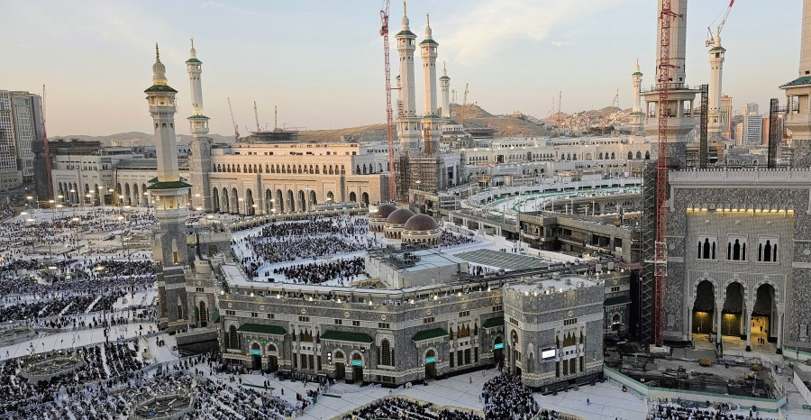

A Journey of the Heart: Visiting Madinah and Makkah
===================================================

For years, I had longed to visit the two holiest cities in Islam: Madinah, the city made sacred by the presence of our beloved Messenger Hazrat Muhammad ﷺ, and Makkah, the house rebuilt by Messenger Hazrat Ibrahim (عَلَيْهِ ٱلسَّلَامُ), also known as Abraham.

Madinah holds a unique place in the hearts of Muslims, not merely for its serene beauty but for the unparalleled honour of the Messenger ﷺ. The love and reverence for him (ﷺ) and visiting him (ﷺ) draw millions to this blessed city, a love that transcends time, borders, and generations. The desire has always been there, but for one reason or another, the journey never materialized.

Last year, my wife and I, along with our young daughter, finally decided to use the holiday season to embark on this deeply spiritual journey. We committed to performing Umrah and dedicating our time to worship and reflection in these sacred lands.

Our journey began in Madinah, the city of peace and tranquility. From the moment we arrived, the serenity of the Masjid an-Nabawi enveloped us. Madinah holds a unique and indescribable sense of calm, a testament to its special place in the hearts of millions. Visiting him (ﷺ), standing before his resting place to offer Salam, praying in his mosque, the Masjid an-Nabawi, and walking through the places where he (ﷺ) once walked, was an emotional and awe-inspiring experience.

Madinah is a city infused with love---love for our Messenger (ﷺ), love for Allah, and love for humanity. Walking through its streets, you feel the presence of history, the weight of devotion, and the unity of millions who visit this blessed place out of their boundless affection for the Messenger (ﷺ). The reverence of the worshippers and the melodious call to prayer only deepened our spiritual connection.

Time in Madinah flew by; we were in a rhythm of getting up early in the morning, coming to the Masjid an-Nabawi at 4 am with thousands of worshippers, praying Fajr with them, and then returning to the hotel for breakfast, and then attending the next four prayers throughout the day. It became a routine that I had long desired, I guess, the only routine I had followed in many years. Rushda's joy in the mosque courtyard, running and singing her ABCs, added a beautiful lightness to our spiritual journey.

One saturday, I even walked from Masjid an-Nabawi to Masjid Quba, the first mosque built by the Messenger (ﷺ). There is a 3.7 km straight walking track from the Masjid an-Nabawi. Although the track was built much later, it follows the path he (ﷺ) used to take every Saturday to visit Masjid Quba. Walking along this route with many others, reflecting on his (ﷺ) footsteps, was a humbling and spiritually enriching experience. Along the roadside, many kind-hearted individuals were offering food for free to visitors, a beautiful act of generosity that reflected the spirit of the city.

After spending 5 days in Madinah, we journeyed to Makkah, the rugged city of mountains and devotion. The contrast between the serenity of Madinah and the bustling energy of Makkah was striking, yet both carried a profound sense of spirituality.

Arriving in Makkah, we donned the white garments of Ihram, symbolizing equality and unity before Allah. It was a humbling experience to stand shoulder-to-shoulder with worshippers from every corner of the globe, united in purpose and devotion. Here, distinctions of wealth, status, and nationality faded away; we were all simply servants of the Almighty.

The sight of the Kaaba for the first time is something I will never forget. The black-draped cube, surrounded by worshippers performing Tawaf, is a powerful symbol of submission to Allah. Despite Makkah's barren, mountainous surroundings, it draws millions of hearts year after year, answering the timeless call of Messenger Hazrat Ibrahim (عَلَيْهِ ٱلسَّلَامُ).

Makkah never sleeps. Its rhythm is fueled by devotion, as worshippers gather in prayer, seeking forgiveness, guidance, and peace.

These days spent in Makkah were transformative. They pulled me out of the lethargy of daily life, awakening a deeper realization: true contentment lies in humility, gratitude, and connection to Allah.

Two weeks passed in the blink of an eye. As we bid farewell to these sacred cities, my heart overflowed with gratitude to Almighty Allah for granting us the opportunity to visit. Madinah, with its serenity and love, and Makkah, with its devotion and energy, left an indelible mark on my soul.

This journey reminded me of life's true essence: humility, gratitude, and devotion to our Creator. I pray that Allah grants everyone the chance to visit these blessed places and experience their profound spiritual beauty.  

*** ** * ** ***

Type your email... {#subscribe-email}
