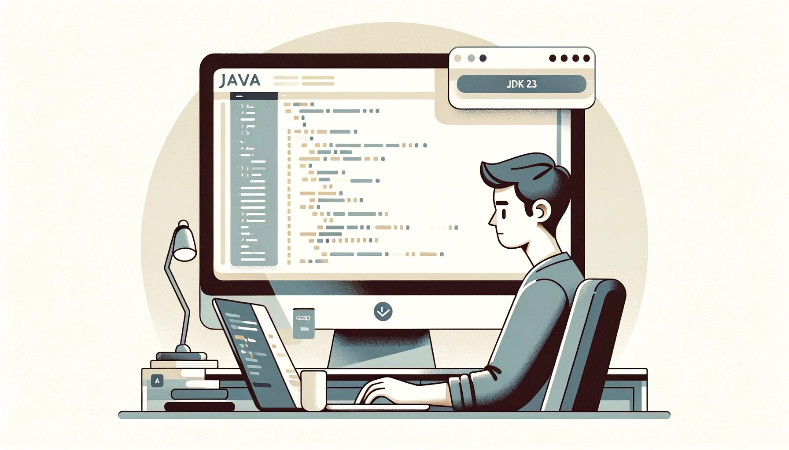

Exploring New Features in JDK 23: A Sneak Peek
==============================================

### The main method and println

With JDK 23 on the horizon, I decided to dive into some of its new features by running the following code in the CLI:

```
void main() {
    println("Hello World");

    var name = readln("Enter your name: ");
    println("Your name is " + name);

    var age = readln("Enter your age: ");
    println("Your age is " + age);
}
```

All I did is, I create a file named. `Main.java`. Then run the following command:

`java --enable-preview --source 23 Main.java`

Here is the output:

    Hello World
    Enter your name: Bazlur
    Your name is Bazlur
    Enter your age: 60
    Your age is 60

One key observation is that `readln` captures input as strings without automatic type conversion, unlike Python. This behavior is expected but worth noting. Although this feature is still in the preview phase, it shows great potential for future enhancements.

### The New java.io.IO Class

The new [java.io.IO](https://github.com/openjdk/jdk/blob/jdk-23%2B25/src/java.base/share/classes/java/io/IO.java) class introduces three additional methods: `println`, print, and readln, which are automatically imported. This makes it easier for beginners as there's no need for extra import statements.

### Downloading JDK 23

Since JDK 23 isn't officially available yet, the Early-Access Builds version is available through SDKMAN, which makes it easier to manage and install. I have installed the `23.ea.25-open`

If you don't have SDKMAN, use this [resource](https://sdkman.io/install#:~:text=It%20effortlessly%20sets%20up%20on,both%20Bash%20and%20ZSH%20shells.) to download and install it. Besides SDKMAN, the OpenJDK JDK 23 Early-Access Builds are available [here](https://jdk.java.net/23/).

### Conclusion

The upcoming JDK 23 release promises to introduce convenient features for developers, particularly beginners. The new IO class is a great example, simplifying input and output operations. As we await the official release, building from the source gives us an exciting preview of what's to come.

More about this can be found here: <https://www.infoq.com/news/2024/05/jep477-implicit-classes-main/>  

*** ** * ** ***

Type your email... {#subscribe-email}
