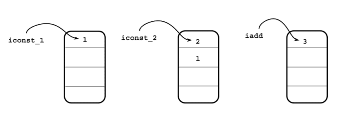

Java Bytecode Simplified: Journey to the Wonderland (Part 1)
============================================================

There are two ways to see a thing. One, see it as it appears to us; two, see it and appreciate it. For example, we get light when we switch on a lightbulb. We press the button and then get busy with our life. Pretty simple, but boring. On the other hand, if we know how the light gets energy from an electrical power grid far from our home with wires and while travelling through the wires and filament, the filament heats up and starts emitting photons, we get to see in the light; we can then appreciate the blessing.

The same way, when we write a piece of code, and if we know the mechanism behind it, we can then appreciate it more, how excellent engineering effort went into it, making our life so amazing.

Today I will make an attempt to appreciate how unique the JVM is. So, let's begin the journey to how Java works!

We all know that the Java compiler takes Java source and then compiles to Bytecode. The process is pretty straightforward. It takes a file and transforms it into Bytecode. The just-in-time compiler (JIT) interprets the Bytecode to machine code so that it can run. While interpreting it, it collects data, for example, how frequently a particular method is called. When a specific portion of code (in hotspot terminology, "hot code") reaches a certain threshold, the JIT optimizes it and further compiles it to direct machine code so that it can perform better. This may seem an oversimplification, which begs for a more extensive explanation.

So in this article, we will keep it short: only one part of it, which is the Bytecode itself. What it is and its internals. It's definitely a fun journey.

Now the first question gets to be: what is **Bytecode**?

If we put it simply, bytecode is a set of instructions that are emitted from the Java compiler and the JVM then executes them.

Each Bytecode is 1 byte long, and that's why it is called Bytecode. We know there are 8 bits in a byte. That's why there are only 2\^8 = 256 possible instructions that we could have in bytecode. Interestingly, we don't even need the whole set of bytecode in Java. Today we use around 205. These are called operation codes or simply "opcodes".

First, we will write a simple Java program and then compile it to see what Java compiler emits:

```
public class Calculator {

  public int add(int a, int b) {
    return a + b;
  }
}
```

That's the simplest Java program we could ever write. It's a class with a public method, "add", which takes two integer arguments and then returns, summing them. That's it.

Let's compile it.

```
javac Calculator.java
```

The above command will produce a class file named "Calculator. class". This file contains a series of bytes, and it's not readable. You won't be able to open it with a text file or anything.

However, an excellent Java command-line tool called "javap" allows us to read this bytecode from a class file. Let's read them as follows:

```
javap -c Calculator
```

We will get the following output if we run the above command in our terminal.

```
Compiled from "Calculator.java"
public class Calculator {
  public Calculator();
    Code:
       0: aload_0
       1: invokespecial #1                  // Method java/lang/Object."<init>":()V
       4: return

  public int add(int, int);
    Code:
       0: iload_1
       1: iload_2
       2: iadd
       3: ireturn
}

```

Look, we can see a constructor here. However, we haven't added that in our Java source code. Well, the Java compiler did that. That's our default constructor. The Java compiler added it.

Let's change gears a bit.

We know the JVM interprets byte code, and it is a stack machine. It has an operand stack. It works like [Reverse polish notation (RPN)](https://en.wikipedia.org/wiki/Reverse_Polish_notation). For example, if we have an expression as follows:

1 + 2, then the RPN would be 1 2 +

If we want to evaluate this using the following images:


Firstly, we will push 1 and 2 to the stack. And then, we will pop these two, add them, and put them in the stack again. The same thing is done in JVM by two instructions: **iconst_\<\>** and **iadd**.



*iconst_1* and *iconst_2* , these two opcodes push 1 and 2 to the stack, and `iadd` opcode pops them from the stack and puts them back after adding them. The *iconst_1* and *iconst_2*are two special opcodes for loading 1 and 2 as they are constant.

Let's get back to the bytecode again.

Bytecode is nothing but a list of instructions. For example, if we want to return from the method, the bytecode would be '**return**.'

This ***return*** opcode is nothing but a representation so that we can read bytecode and reason about it. In the class file, it is just a series byte. The hex value of the return is B1, and its binary is- *1011 0001.*

JVM can understand these byte series and then convert them to appropriate machine code.

Let's see another example --

|-----------------------------------------------------|-------------------------------------|--------------------|------------------------------------------------|
| java source code                                    | opcode                              | hex                | binary                                         |
| ``` int add(int a, int b) {     return a + b; } ``` | iload_1 <br /> iload_2 iadd ireturn | 1B <br /> 1C 60 AC | 0001 1011 <br /> 0001 1100 0110 0000 1010 1100 |

In the above table, we have a method which takes two integers arguments and then adds them. Over here, `a` and `b` are not constant; that's why `iload_1` and `iload_2`, these two opcodes are used. The generic format of this bytecode for loading integers is: `iload_<n>`. It essentially means that the is an index of the array of the local variables. The parameters are, in fact, local variables. `iload_1` loads the `a` and `iload_2` loads the `b`.

Now, look at the following method:

```
public int add() {
    return 1 + 2;
}
```

However, here is a caveat. If you write the above method, then compile it and try **javap** to read it, you will find something like this --

```
0: iconst_3
1: ireturn
```

The reason is that the Java compiler does a bit of optimization; when it sees we are just adding 1 and 2 and then returning their value, it can just load the 3 into the stack with one instruction rather than using 3 instructions. We will know much more about these sorts of optimization later.

Let's assume the Java compiler doesn't do this little optimization in this article. The opcode, *iconst_1* and *iconst_2* will put the 1 and 2 in the stack and then use `iadd` to pop these two, add them and then put their result back to the stack and return.

That's a brief introduction to how Java bytecode and how it looks and works. We will go a bit further in our next article.

But before closing the article, I can't resist sharing a simple piece of Java code that can read a class file, convert it into a series of bytes, and print it out for you so you can see it the way the JVM sees it.

```
package ca.bazlur;

import java.io.IOException;
import java.nio.file.Files;
import java.nio.file.Path;

public class BytecodeReader {

  public static void main(String[] args) throws IOException {
    Path classfile = Path.of("src/Calculator.class");// put path of your classfile here
    byte[] bytes = Files.readAllBytes(classfile);
    for (byte aByte : bytes) {
      //ref https://stackoverflow.com/a/12310078/893197
      String byteString = String.format("%8s", Integer.toBinaryString(aByte & 0xFF))
          .replace(' ', '0');
      System.out.println(byteString);
    }
  }
}
```

If you run this program, you will get a series of 1 and 0. Those are bits. Every 8 bits make a byte, and each byte represents an opcode. The list of all opcode can be found here:

<https://en.wikipedia.org/wiki/List_of_Java_bytecode_instructions>

That's all for today!

Happy coding!  

*** ** * ** ***

Type your email... {#subscribe-email}
