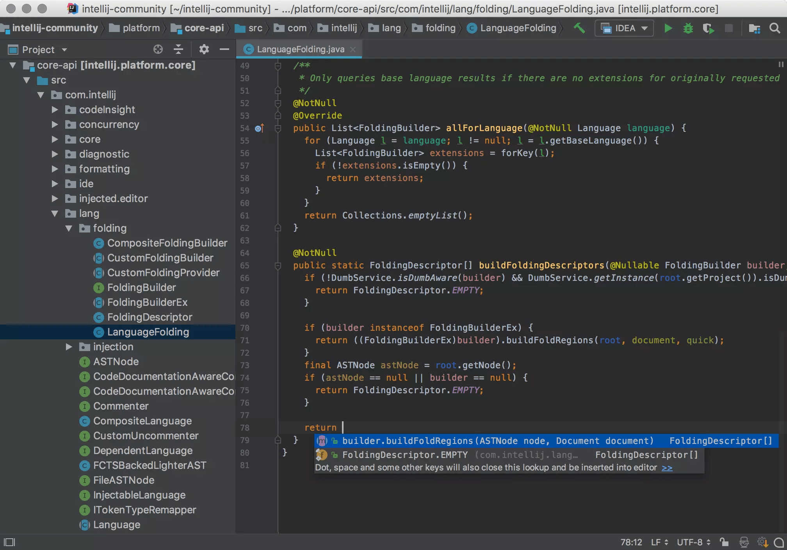

How to run the Java Incubator Module from the Command Line and IntelliJ IDEA
============================================================================

[JEP 425: Virtual Threads (Preview)](https://openjdk.java.net/jeps/425) has been proposed recently. It has been a long-awaited feature in Java. It opens the door to Structured Concurrency. This article isn't about it, in case you are interested, you can read, the [JEP draft: Structured Concurrency (Incubator)](https://openjdk.java.net/jeps/8277129)

Also, if you are interested in how the incubator module works, please read: [JEP 11: Incubator Modules](https://openjdk.java.net/jeps/11)

I downloaded the [early access build](https://jdk.java.net/loom/) and wrote the following very simple program that demonstrates structure concurrency.

```
import jdk.incubator.concurrent.StructuredTaskScope;

import java.util.Random;
import java.util.concurrent.Future;
import java.util.concurrent.TimeUnit;

public class Main {
    public static void main(String[] args) {
        int fooBaz = foo();
        System.out.println("fooBaz = " + fooBaz);
    }

    private static int foo() {
        try (var taskScope = new StructuredTaskScope.ShutdownOnFailure()) {
            Future<Integer> f1 = taskScope.fork(Main::baz);
            Future<Integer> f2 = taskScope.fork(Main::baz);

            taskScope.join();
            return f1.resultNow() + f2.resultNow();
        } catch (InterruptedException e) {
            throw new RuntimeException(e);
        }
    }

    private static int baz() {
        try {
            TimeUnit.SECONDS.sleep(1);
        } catch (InterruptedException e) {
            throw new RuntimeException(e);
        }
        return new Random().nextInt();
    }
}
```

I tried to run the command line using the [source code launcher](https://openjdk.java.net/jeps/330) but end up getting the following error-

```
$ java Main.java 

Main.java:1: error: package jdk.incubator.concurrent is not visible
import jdk.incubator.concurrent.StructuredTaskScope;
                    ^
  (package jdk.incubator.concurrent is declared in module jdk.incubator.concurrent, which is not in the module graph)
1 error
error: compilation failed
```

The reason is that the features are being developed under the incubator module which isn't visible. If we want to use the module, we need to explicitly add a module while you run it. Let's fix it.

```
$ java --add-modules jdk.incubator.concurrent Main.java

WARNING: Using incubator modules: jdk.incubator.concurrent
warning: using incubating module(s): jdk.incubator.concurrent
1 warning
fooBaz = 327780169
```

It worked.  


Then I thought why not do it with my favourite IDE, IntelliJ IDEA.   


Here are the steps: --

First, we need to go preference, and then **Build, Execution, Deployment** and then Select Java Compiler.


At the bottom, there is a box named the additional command line parameter. Add the following line there-

```
--add-modules jdk.incubator.concurrent
```

And then go to the run configuration. Select the modify options and Mark the Add VM options.


We need to add **--add-modules jdk.incubator.concurrent** there as well.

Similarly, way we can add other incubator modules as well, such as ***jdk.incubator.foreign***


That's it.

This is how we can run the incubator feature from IntelliJ IDEA.  

*** ** * ** ***

Type your email... {#subscribe-email}
