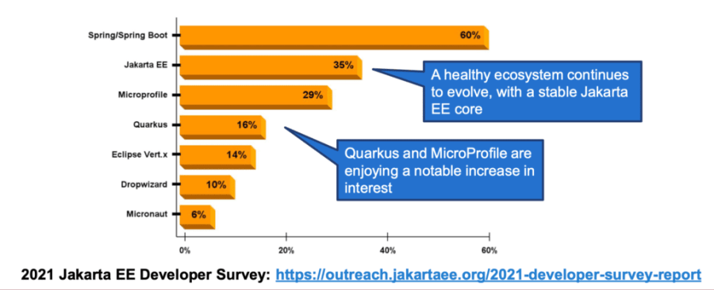

Top 7 Features in Jakarta EE 10
===============================

Java EE has been a dominant force behind all enterprise development in Java. Lately, it was renamed to [Jakarta EE](https://jakarta.ee/), while transitioning to the Eclipse Foundation.

This transition opened the door to open governance, open compatibility testing (the earlier [Technology Compatibility Kit](https://en.wikipedia.org/wiki/Technology_Compatibility_Kit) was closed source), and of course, open-source contributions. That means no specific vendor has more influence than any other and it is a more distributed process now.

Jakarta EE is an integral part of the Java ecosystem. 25-35% of Java application runs on JakartaEE application servers. WildFly, JBoss EAP, Payara, WebSphere/Liberty, WebLogic etc., are some examples of these application servers. These application servers are developed and maintained by different vendors. However, as a technology, Jakarta EE remains vendor-neutral, meaning that the same application code should be able to be run by means of any of the application servers since all vendors adhere to [Jakarta EE specifications](https://jakarta.ee/specifications/).

70-80% of Java applications use Jakarta EE APIs one way or another, such as Tomcat, Hibernate, ActiveMQ, Jetty, CXF, Jersey, RESTEasy, Quarkus, Microprofile, and Spring. If we dig a little deeper, we will find Jakarta EE APIs behind Java applications.


Jakarta EE is a lively ecosystem. We have Jakarta EE, [MicroProfile](https://microprofile.io/), and [Helidon](https://helidon.io/). [Quarkus](https://quarkus.io/), introduced after [Micronaut](https://micronaut.io/) and Helidon, remain a popular framework. Many applications are yet to migrate and that's why Java EE 8 is still around. However, Jakarta EE 9 may be considered to be a foundation for innovation to drive new features in Jakarta EE 10, which will be released soon.

Jakarta EE 9 moves all relevant specifications `javax` to the Jakarta namespace. Unfortunately, that has caused some breaking changes, but the migration seems relatively easy. There are tools to do that. It also removes older deprecated technologies and moves Java 8 to Java 11.

Among the many features making their way to Jakarta EE 10, I will discuss the top 7, in no particular order.

1. **@ManagedExecutorDefinition**
---------------------------------

One of the most commonly used services in the Jakarta Concurrency API is the [ManagedExecutorService](https://github.com/jakartaee/concurrency/blob/master/api/src/main/java/jakarta/enterprise/concurrent/ManagedExecutorService.java).

It is used to create a thread pool in the Jakarta EE environment to spawn threads in a more manageable way.

Although it is pretty much the same as [ExecutorService](https://docs.oracle.com/en/java/javase/17/docs/api/java.base/java/util/concurrent/ExecutorService.html), we employ it in the Java SE environment.

To configure the thread pool, we had a vendor-specific setting. Now it can be defined with just annotations. This is a more standard way of configuring the thread pool.

```
package ca.bazlur;

import static jakarta.enterprise.concurrent.ContextServiceDefinition.APPLICATION;
import static jakarta.enterprise.concurrent.ContextServiceDefinition.SECURITY;

import jakarta.annotation.Resource;
import jakarta.ejb.Asynchronous;
import jakarta.enterprise.concurrent.ContextServiceDefinition;
import jakarta.enterprise.concurrent.ManagedExecutorDefinition;
import jakarta.enterprise.concurrent.ManagedExecutorService;
import jakarta.enterprise.context.ApplicationScoped;
import jakarta.inject.Named;
import java.time.Duration;
import java.time.LocalDate;
import java.util.concurrent.CompletableFuture;

@Named
@ApplicationScoped
@ManagedExecutorDefinition(
    name = "java:module/concurrent/MyExecutor",
    context = "java:module/concurrent/MyExecutorContext",
    hungTaskThreshold = 120000,
    maxAsync = 5)
@ContextServiceDefinition(
    name = "java:module/concurrent/MyExecutorContext",
    propagated = {SECURITY, APPLICATION})
public class WorkService {

  @Resource(name = "java:app/concurrent/MyExecutorService")
  private ManagedExecutorService executor;

  @Asynchronous
  public CompletableFuture<Long> hoursWorked(LocalDate from, LocalDate to) {
    return CompletableFuture.supplyAsync(() -> heavyAPICall(from, to), executor);
  }

  private static long heavyAPICall(LocalDate from, LocalDate to) {
    return Duration.between(from, to).toMillis();
  }
}
```

2. @Asynchronous
----------------

There is a similar annotation available in EJB. A method annotated with this annotation is supposed to run asynchronously. However, the EJB one is a bit out of date.

Also, in EJB, we can't specify the thread pool. It used to use the app server's default thread pool. Now the new annotation jakarta.enterprise.concurrent.Asynchronous

comes with [Jakarta EE Concurrency 3.0](https://jakarta.ee/specifications/concurrency/3.0/), which doesn't require using EJB, and we can specify the thread pool. It can be used with any CDI bean. Each asynchronous method execution corresponds to a managed `java.util.concurrent.CompletableFuture` instance that is backed by a `jakarta.enterprise.concurrent.ManagedExecutorService` as its default asynchronous execution facility.

```
package ca.bazlur;

import jakarta.enterprise.concurrent.Asynchronous;
import jakarta.enterprise.context.ApplicationScoped;
import jakarta.inject.Named;
import java.util.concurrent.CompletableFuture;
import java.util.concurrent.CompletionException;

@Named
@ApplicationScoped
public class PaymentService {

  @Asynchronous(executor = "java:app/concurrent/MyExecutorService")
  public CompletableFuture<Confirmation> processPayment(final Order order) {
    try {
      var status = processOrder(order);

      return CompletableFuture.completedFuture(status);
    } catch (PaymentException ex) {
      throw new CompletionException(ex);
    }
  }

  private Confirmation processOrder(Order order) {
    return new Confirmation();
  }
}

class PaymentException extends RuntimeException {
}

record Confirmation() {
}

record Order() {
}
```

3. Bootstrap API
----------------

If you are invoking a REST service outside of a Jakarta EE environment, e.g., unit tests, integration tests etc., this is good to have a standalone API to do that.

With this, you don't need to run the entire container. Thus, it becomes very convenient.


4. Multipart/Form-Data
----------------------

[Jakarta RESTful Web Service](https://jakarta.ee/specifications/restful-ws/) is one of the popular features among developers to expose restful endpoint. However, it didn't quite support multipart form data in a standard way.

That's why, for years, developers needed either Servlets or a vendor-specific REST API to handle the multipart media type.

With the Jakarta REST 3.1, we no longer have to deal with such an issue, and it adds full support for multipart form data, which is standard.

```
package ca.bazlur;

import jakarta.ws.rs.Consumes;
import jakarta.ws.rs.FormParam;
import jakarta.ws.rs.POST;
import jakarta.ws.rs.Path;
import jakarta.ws.rs.core.EntityPart;
import jakarta.ws.rs.core.MediaType;
import jakarta.ws.rs.core.Response;
import java.io.InputStream;


@Path("/job")
public class FileResource {

  @Path("/apply")
  @POST
  @Consumes(MediaType.MULTIPART_FORM_DATA)
  public Response applyForJob(
      @FormParam("name") String name, @FormParam("recentPhoto") EntityPart photo,
      @FormParam("resume") EntityPart resume) {
    processApplication(name,
        photo.getMediaType(), photo.getContent(), resume.getMediaType(), resume.getContent());
    return Response.ok("Application received").build();
  }

  private void processApplication(String name, MediaType mediaType, InputStream content,
      MediaType mediaType1, InputStream content1) {
  }
}
```

5. **@OpenIdAuthenticationDefinition**
--------------------------------------

Well, for many years, we have been using usernames and passwords for authenticating users in a web application. However, in modern applications, it has become widespread to log in using other services, e.g., Facebook, Google, Twitter, etc.

The OpenID Connect protocol powers this kind of authentication. With [Jakarta Security 3.0,](https://jakarta.ee/specifications/security/3.0/) we now have a standard way to adhere to OpenID Connect by using just an annotation, which is @ OpenIdAuthenticationDefinition.

Life is much simpler now; specify the required properties, such as Provider URI, clientId, clientSecret, redirect URI, etc.

```
@OpenIdAuthenticationDefinition(
       providerURI = "https://sample-openid-server.com",
       clientId = "87068hgfg5675htfv6mrucov57bknst.apps.sample.com",
       clientSecret = "{my-secret}",
       redirectURI = "${baseURL}/callback",
       extraParameters = {
            "testKey=testValue",
            "testKey2=testValue2"
       }
)
public class SecurityConfig {
}
```

6. **UUID Key**
---------------

[Jakarta Persistence 3.1](https://jakarta.ee/specifications/persistence/3.1/) brings `java.util.UUID` is to be used as a basic type of field, which is very convenient for entity IDs for the cloud environment since many databases don't automatically generate UUID.

```
package ca.bazlur;

import jakarta.persistence.Entity;
import jakarta.persistence.GeneratedValue;
import jakarta.persistence.GenerationType;
import jakarta.persistence.Id;
import java.util.UUID;

@Entity
public class User {

  @Id
  @GeneratedValue(strategy = GenerationType.UUID)
  private UUID id;

  private String username;
  private String password;
}
```

Besides, it brings several functions to the query language and Criteria API. The new functions fall into three categories:

* Numeric functions (CEILING, EXP, FLOOR, LN, POWER, ROUND, SIGN)
* Functions that return the current local date and time using **java.time** types (LOCAL DATE, LOCAL DATETIME, LOCAL TIME)
* The EXTRACT function extracts a numeric part from a given date (YEAR, QUARTER, MONTH, WEEK, DAY, HOUR, MINUTE, SECOND)

7. Jakarta Faces Views with Pure Java
-------------------------------------

[Jakarta Faces 4.0](https://jakarta.ee/specifications/faces/4.0/) brings a new API to define the full view (HTML Pages) using only Java Code.

If you are particularly not interested in writing any kind of tagging language whatsoever, you can now write your UI code entirely in Java with the pure Java Faces view. I love it.


Conclusion
----------

Now a bit about Jakarta EE ambassadors.

We are an independent grassroots group of people committed to moving Jakarta EE forward through active community participation and advocacy.

If you want to join and contribute, find out more here: [https://jakartaee-ambassadors.io/.](https://jakartaee-ambassadors.io/)

The final release of the entire Jakarta 10 platform will be during the coming month. Find out more here [Jakarta EE 10 release plan](https://eclipse-ee4j.github.io/jakartaee-platform/jakartaee10/JakartaEE10ReleasePlan).  


Finally, if you want to know more about what's going on with Jakarta EE, please watch this [session](https://www.youtube.com/watch?v=-ZE6CoH3uWQ) by [Reza Rahman](https://www.linkedin.com/in/javareza/)!  

*** ** * ** ***

Type your email... {#subscribe-email}
