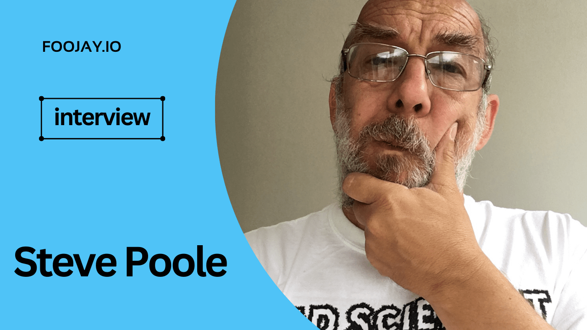

From Assembler to Chat-GPT: Steve Poole on the Shifting Landscape of Programming
================================================================================

Welcome to our exclusive interview with [Steve Poole](https://www.linkedin.com/in/noregressions/), a seasoned Java developer, leader, and evangelist with a lot of experience in the tech industry.

As a Developer Advocate for [Sonatype](https://www.sonatype.com/), Steve has been deeply involved in Java SDKs and JVMs since Java was less than version 1.

In his long and successful career, he has had many roles, such as being a representative or lead on different [Java Specification Requests](https://jcp.org/en/jsr/overview) (JSRs), committing to many open-source projects at [Apache](https://www.apache.org/), [Eclipse](https://www.eclipse.org/org/foundation/), and [OpenJDK](https://openjdk.org/), and actively taking part in the [Adopt OpenJDK group](https://adoptium.net/en-GB/) to promote community involvement.

Today, we have the unique opportunity to gain insights from Steve on his journey in the tech world, his thoughts on the ever-evolving landscape of software development, and the valuable lessons he has learned along the way. Steve regularly speaks on technical and software engineering topics at international conferences. His knowledge and experience will surely help developers at all stages of their careers.  

So, let's dive into our conversation with the remarkable Steve Poole without further ado.

### Key Takeaways:

1. Computers are there to change lives for the better. Developers get the most fun and satisfaction when they do something that helps someone else be successful.
2. The software development industry has evolved significantly over the years, with changes in technology, processes, and productivity. Some of the most significant changes have been the adoption of agile, the rise of open source, the democratization of programming, and the emergence of SaaS-based tools.
3. To stay relevant in the industry, developers must continuously learn and adapt to new technologies while developing their critical thinking skills.
4. The rise of AI-generated code is unlikely to lead to job losses for developers but rather to transform their role into something higher.
5. Developers should choose a career path they are passionate about and find job satisfaction. They can choose to be a technical pond-skipper and try new jobs every year or two with the latest tech or be the deep technical person who understands a great deal about a specific tech.
6. Making decisions about changing careers or taking on new challenges is always a leap of faith. Balancing the expected benefits against the worst-case scenarios is essential.
7. When diagnosing problems, avoid pre-emptive guessing and assumptions. Take a step back and understand the situation before trying to fix it.
8. A good leader must be able to translate hardware improvements into software performance and understand how the industry works. They should also have good communication skills, be approachable, and have empathy for their team members.

> *Fun fact:*   
> *Steve Poole plays board games on Monday evenings with a friend. They have been doing it for years and years. During the lockdown, they played remotely over Zoom! Steve enjoys cooperative games, short war games with figures or blocks (his favorite being Memoir 44), and the occasional complicated and very long-running games. He owns more computing kits than he cares to mention -- from ESP32s upwards. Steve loves tinkering with robots and creating Heath Robinson-style contraptions. His favorite creation was a Harry Potter-style hairy "Monster Book of Monsters" that growled and shook if you got too close.*

### Bazlur: Can you tell us about your background and how you got started in the software industry?

**Steve Poole**: I live in the UK. I have a wife, three grown-up daughters, and more gadgets than I can count. I did computing at school---basic, of course---but it didn't excite me. As a kid, I wanted to be a fighter pilot, but that wasn't an option since I'm shortsighted. Next, I wanted to be an architect, so I went to university.

While there, I got access to the department's mainframe and its raster graphics terminals. I was hooked. All I wanted to do was create 3D graphics with computers, but obviously, it was way, way, way too early. I ditched architecture and moved to computing. Then tried to find a job -- none around. I didn't have any practical experience. I joined a local college and took a data processing course, and while doing that, I managed to get a few home computers (<https://en.wikipedia.org/wiki/Dragon_32/64>).

I built one of these<https://en.wikipedia.org/wiki/ZX80>, etc. So, I left college armed with practical software skills and some basic understanding of hardware. I got a job as an operator on a mini-computer for a local company, learned its programming language (RPG), and started writing code for a living.

**Editor's note:**

*Steve Poole's journey emphasizes adaptability, passion, and the value of hands-on experience in shaping a fulfilling career, even when faced with obstacles and changing paths.*

*** ** * ** ***

### Bazlur: What was your first experience like working as an operator on a mini-computer for a local company, and how did it shape your career path moving forward?

**Steve Poole**: It was dirty, smelly, and hard physical work. Computers were big, printers, tape drives, etc., were big too. We went through hundreds of boxes of paper (about A3 size page equivalent) per month, and my colleagues and I had to carry them all up three flights of stairs. But I loved it. I left home early and stayed late.

What I learnt, though -- and this has stayed with me always -- is that computers are there to change lives for the better. I get the most fun and satisfaction when I do something that helps someone else be successful. Seeing their smile when you've solved their problem, taken some drudgery away, etc.

That's what gets me up at night, and it still does. So my career has been this mix of hardware, software, business development, developer relations, and education.

**Editor's note:**

*Steve's journey shows how important it is to be committed and find meaning in one's work, as he feels fulfilled by using technology to make a positive difference in the lives of others.*

*** ** * ** ***

### Bazlur: You mentioned that you've worked in hardware, software, business development, developer relations, and education throughout your career. How has software development specifically changed since you first started working in the industry, and how have you adapted to these changes? As someone who has seen the evolution of software development firsthand, what do you think are some of the most significant changes or advancements in software development that you've seen over the course of your career that has impacted you personally and the community as a whole?

**Steve Poole**: Good questions. Number one is that we all take source control management systems (SCMs) for granted. When I started, they hardly existed. Getting access to a previous version of the source required using the tape drive!

The second is that waterfall was the predominant process, and the separation between roles was pretty rigid. Programmers (we weren't developers then) mostly had to stop being coders to get a promotion. Of course, the internet and access to open source are the biggest changes; a close second is Java, which brought in cross-platform capabilities and higher programming abstractions.  

The third has been the adoption of agile and its descendants, like DevOps.  

Fourth is hardware speed and cost. All of this is taken for granted now, but I can say each one had some significant impact on me. Java and hardware performance are the biggest since I'm a JVM guy, and my job was translating hardware improvements into Java performance. But I also ran the IBM European DevOps group for a while, so learning and teaching DevOps changed how I thought.

As the lead for IBM's Java, adopting agile (and later scrum) dramatically changed how I ran the team. Basically, as I led larger and larger teams, I was lucky in that ideas on how to do that effectively were growing too. There is no way I would want to lead 300 people to deliver Java on 22 platforms using Waterfall.

From an industry POV, I'd say that programming is completely democratized now. Anyone can be one. Whether you can get paid is a different story, but it's possible to demonstrate your skills, and that's almost all that matters now.

When I started, the code was poorly written, hardly tested (mostly by end users), and obviously never shared.

And smaller in scope, machines were much less powerful (and pre-Java), so creating complex programs was hard. Modern developers have access to information and reusable code. Nowadays, we say 90% of an app is open source. It would have been 0% when I started. Everything was bought or written in-house. So productivity was pretty low. Two- to three-year delivery cycles were common.

 

**Editor's note:**   
*Steve's experience showcases the programming landscape's evolution, emphasizing the importance of embracing change and innovation. The shift from rigid processes to agile methodologies and programming democratization highlights the need for continuous learning and adaptability in a rapidly evolving field.*

*** ** * ** ***

### Bazlur: Wow, how much the industry has changed over the years is incredible. With all these changes happening rapidly, what skills do you think are essential for developers to stay relevant in the industry, especially with emerging technologies like AI and machine learning? And how do you suggest developers keep up with the constant changes and advancements? Additionally, In your opinion, what are some of the biggest challenges that developers face today?

 

 

**Steve Poole** : Keeping up to date is a continuous challenge. As developers, we should all have some expertise in <https://en.wikipedia.org/wiki/Critical_thinking> anyway. My advice is to use and grow that skill so you can apply it to new technologies when they appear. Get to the core of the concept quickly and find a suitable analogy; then, it's much easier to learn about the technology without going into the weeds. Of course, the other thing to do is to use your hands. Play with the tech. Find a suitable use case that's meaningful for you and figure out how to deliver a solution with the new technology.

The two things I did with Java when it first arrived on my lap were to build a build system using it and to write a class file parser. Having given that advice, I'd say it's going to get harder for us as more of the important tech we use becomes SaaS-based, black-box stuff. Things like Chat-GPT, where the investment in training is so expensive, are never going to get released in a form you might hack on.  

On a non-technical note, the rising challenge of cybercrime is also going to have an effect on developers. How we develop code is going to change, and the availability and licenses of open source are going to change too. I expect to see more focus on software engineering principles come to the fore as companies making software available have to do more to prove its safety.

***Editor's note:**Steve's insights highlight the need for developers to cultivate critical thinking and hands-on experience, adapting to industry changes by focusing on software engineering principles and ensuring code safety in an ever-evolving landscape.*

*** ** * ** ***

### Bazlur: As AI continues to advance, many new developers are worried that their job prospects may be limited, and they may even lose their jobs. What advice would you give these developers, and do you share their concerns, given your experience with many technological shifts?

 

**Steve Poole:** I don't really share their concerns for four reasons at the moment.  

Firstly, generative AI tools like Chat-GPT, Copilot, etc., are trained on code to match patterns. Input and output are based on that corpus. If we all stop writing code, who will generate the base data for the tools?

More seriously, these tools can often generate totally bogus/fictitious answers, so any code they generate other than the superficial stuff will need review. It saves you some time, but how much in reality?   

Thirdly, the ownership of the IP in the output is still being determined. There are some signs that the law is heading toward the IP being owned by the tool owners and not the consumers, and that it may not be possible to license that IP.  

Finally, I see that these tools fulfill the same role as others: the same progressive advancement. We used to write code in assembler -- we got 'c' compilers. We used to have to deal with memory management; now, we have garbage collectors. Developers didn't lose their jobs; rather, they transformed into something higher level.

I've seen some great examples where tools like Chat-GPT help developers debug or understand code. Using the tools appropriately will be a great benefit to us.

**Editor's notes:**   
*Steve points out that AI tools still need human review and input, IP ownership issues have not been solved, and developers have always been able to adapt to new technologies. Developers should view AI tools as a means to enhance their work while continuing to evolve in their roles.*

*** ** * ** ***

### Bazlur: Your insights on AI-generated code were fascinating! While it can be helpful for programmers, in the end, programming is ultimately a creative process that requires human expertise. Based on your experience, what advice would you give to new programmers who are uncertain about the prospects of their careers and are unsure of the steps they should take to ensure their careers are on the right track? With so much noise on the internet, it can be difficult for newcomers to navigate the field and determine which technologies to focus on.

**Steve Poole**: I didn't plan to be a developer, so my initial motivations differed. However, I have been fortunate to learn that I love being one and couldn't imagine doing anything else now. Having said that, keeping your career moving, whether for love or money, is similar. There are particular patterns of career you can take; mostly, it's about balancing moving on with putting down roots.

You can be a technical pond-skipper and try for a new job every year or two with the latest technology. That requires learning new technology all the time and being able to apply it quickly, pragmatically, and successfully. On the other end of the spectrum is the deep technical person who understands a great deal about a specific technology. That route takes you down a career path of longer stints with an employer and generally means your chances to learn new, unrelated tech is harder.

But you can often pick up better pay because of the experience and related business knowledge you've gained. There are obviously other combinations, and you might want to move into team leadership or management, which is a different career path altogether. My simple, practical advice is threefold.

1. Keep an eye on the tech market at all times, what's trending, what it pays, etc., dabble in tech all the time, try things out, kick the tyres, and generate an informed opinion.
2. The tech world is like politics. Everything happens for a reason, and almost all reasons are driven by business. Watch and learn how our industry works, and you'll be better able to choose a valuable career path.
3. Whatever you choose to do, whatever route you go down -- make sure it's really what you want. Of course, money is essential, but so is job satisfaction. As developers, were are creative people -- jobs that pay well but limit your ability to be creative will ultimately leave you empty. So choose wisely!

 

**Editor's note:** *Steve's advice on moving up in the tech industry is to stay current on market trends, understand the forces that drive the industry, and ensure that your career path makes you happy. He talks about how important it is to keep learning, know the business world, and find a balance between making money and enjoying your job. Developers are creative individuals who thrive when they can exercise their creativity.*

*** ** * ** ***

### Bazlur: That's great advice! It seems like you have found a career that you truly love. I'm curious, have you ever faced a crossroads in your career where you had to choose between taking on new challenges and sticking with what you know? If so, how did you approach that decision-making process?

 

**Steve Poole:**I've had multiple occurrences. I'm unsure if there is ever a robust strategy for making these decisions, or at least how not to score the options. That is pretty unique to everyone. Almost everything is a leap of faith.

Whatever you decide, you never have all the facts until it's too late. So perhaps the approach is about balancing the expected benefits against the worst-case scenarios. How irreversible is the decision? Do you have an escape plan? etc. vs. does this new opportunity provide growth? An opportunity to learn new skills? Is it likely to be fun?

Whatever your personal process is, I'd say, there is one thing you must commit to before changing things -- and that is you will stick with the new thing regardless of any immediate regrets, for a good period -- 6 months, a year etc. Give it a chance, dive in, and accept it as a new life lesson. Quitting early will tarnish your reputation and, more importantly, will set a pattern in your life about avoiding risk -- and you must take risks to grow. As a mentor once said to me a long time ago, "You get what you settle for."

If you don't take chances and don't try different things, you're actively opting out and settling for whatever you have now.

 

**Editor's note:** *Steve's reflections emphasize the importance of balancing potential benefits and risks in career decisions, embracing change, and committing to choices. This mindset encourages growth and highlights the idea that "you get what you settle for."*

*** ** * ** ***

### Bazlur: Thank you for sharing your valuable insight with us; I am sure our readers will benefit immensely. On a different note, could you tell us some funny or interesting stories from your time in the software industry?

**Steve Poole**: How much time do you have?

A long time ago, I was involved in a network performance problem. The customer's internal Windows network monitor would trigger alerts of a performance issue, but every time the customer tried to figure out what was happening, the problem disappeared. It didn't matter how long they waited---they'd get alert after alert until they signed onto the monitoring system.

Eventually, they realized that the problem was the monitoring system itself; it would eat all the available CPU, which stopped the h/w monitoring from functioning correctly. So now they'd wait for the problem to occur, then look at the process list on the monitor to see what was eating all the CPU. But that didn't work either---the same thing; I logged on, and the problem disappeared.

For weeks and weeks, we tried different things to capture the problem until someone realized that the Windows machine was running a 3D screen saver. Which, of course, was terminated every time you signed in! The cause had been in front of our noses for weeks.

Unfortunately, we just made assumptions before we'd even started about the problem -- rather than stepping back and understanding the situation, we just allowed a rogue screen saver to eat all the CPU right in front of us! That taught me a great deal about how to really diagnose problems and avoid pre-emptive guessing and assumptions.  

**Editor's note:** *Steve's anecdote emphasizes the importance of thorough diagnosis and avoiding assumptions when tackling problems. This lesson highlights the need to step back, understand the situation, and remain open to possibilities, which is applicable across various problem-solving contexts.*

*** ** * ** ***

### Conclusion:

In conclusion, our insightful conversation with Steve Poole has provided a wealth of knowledge and invaluable lessons for developers and tech enthusiasts alike.

Throughout the interview, Steve's love of technology, dedication to learning new things, and focus on adapting to the constantly changing world of software development have stood out.

His personal stories and anecdotes are interesting and show how important it is in a career to think critically, accept change, and take calculated risks.

We are genuinely grateful to Steve for taking the time to share his wisdom and expertise with us. As we reflect on the lessons learned from this interview, we hope his journey will inspire and guide developers at all stages of their careers.

By embracing Steve's advice and wisdom, we can all strive to become better problem solvers, innovators, and contributors to the world of technology.  

**I hope you, as a reader, have found this interview beneficial. Stay tuned for next week's interview with another industry star.**  

*** ** * ** ***

Type your email... {#subscribe-email}
