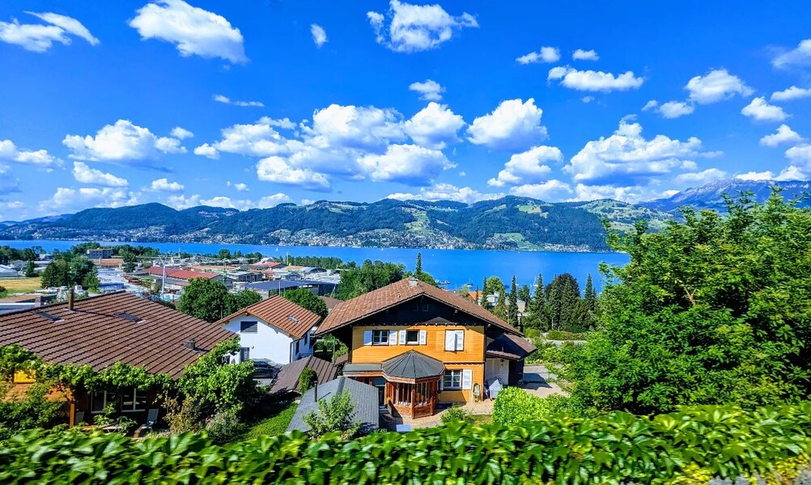

Code, Conferences, and the Swiss Alps: A Monthly Roundup
========================================================

Apologies for the slight delay in delivering this month's newsletter. The breathtaking allure of the Swiss Alps can make one lose track of time, and that's precisely what happened to me last week during my travels.{#ember241}

I had the honour of being a speaker at [JCon 2023](https://sched.co/1LgSj), a conference held in Cologne, Germany. The event was a resounding success and gave me an unexpected surprise. I finally had the chance to meet my long-time mentor, [Bruno Souza](https://www.linkedin.com/in/brjavaman?miniProfileUrn=urn%3Ali%3Afs_miniProfile%3AACoAAAAFPQsBWOMYdNqXsvhAxcjYibZPkgh8zA0), in person. We had previously discussed whether he would attend the conference, but he initially indicated he wouldn't. Imagine my surprise when I saw him delivering a keynote session!{#ember243}  

Accompanying me on this trip were my wife and our 5-month-old baby. Post-conference, we took the opportunity to explore Switzerland for three days. The splendour of Switzerland is globally recognized, and my words can hardly do it justice. But let's get back to the purpose of this newsletter.{#ember246}

**Original Content:**{#ember248}

* [Structured Concurrency in JDK 21](https://www.infoq.com/news/2023/06/structured-concurrency-jdk-21/)
* [Quarkus Improves Cloud-Native](https://www.infoq.com/news/2023/05/quarkus-improves-cloud-native)
* [Java Gets Boost with Record](https://www.infoq.com/news/2023/05/java-gets-boost-with-record)
* [Beginner-Friendly Java](https://www.infoq.com/news/2023/05/beginner-friendly-java/)
* [Exploring Java 21's Intriguing Additions](https://foojay.io/today/exploring-java-21s-intriguing-additions-unveiling-new-features-part-1/)

**Articles Reviewed:**{#ember250}

* [Managing Full-Stack Java Development with Hilla](https://www.infoq.com/articles/how-to-manage-full-stack-java-development-with-hilla/)
* [Pattern Matching for Switch](https://www.infoq.com/articles/pattern-matching-for-switch/)

**Exclusive Interviews Conducted:**{#ember252}

* [Breaking the Code: Chris Newland on JVM Performance](https://foojay.io/today/breaking-the-code-how-chris-newland-is-changing-the-game-in-jvm-performance/)
* [Cracking Code and Conventions: Nicolas Frankel](https://foojay.io/today/cracking-code-and-conventions-an-exclusive-interview-with-nicolas-frankel/)
* [Resilience in Coding: Miro Wengner](https://foojay.io/today/resilience-in-coding-miro-wengner-on-thriving-in-the-software-industry/)

> *If you want to specialize in Java performance, then learn how the full execution stack works and understand what and how to measure. Accept that your intuition for improvements will often be wrong. -- Chris Newland*
> {#ember254}
> *Be passionate about what you do. Once you lose passion, it becomes a regular job. If you're not passionate about your job, change it! We (technical people) are very fortunate that there are more positions than the available workforce.*-- Nicolas's parting advice.
> {#ember255}

**Recommended Reads:**{#ember256}

* [The Anatomy of a JVM](https://foojay.io/today/the-anatomy-of-a-jvm/)
* [Framework Architectural Decisions](https://www.infoq.com/articles/framework-architectural-decisions/)
* [JIT and AOT Tradeoffs](https://www.infoq.com/presentations/jit-aot-tradeoffs/)
* [Java CompletableFuture internals](https://deepakvadgama.com/blog/completable-future-internals/)

Additionally, I presented the following talks at the [JCon Europe](https://2023.europe.jcon.one/).{#ember259}  
<https://speakerdeck.com/bazlur_rahman/a-tale-of-two-cities-blocking-code-vs-non-blocking-code>  

I hope this compilation will keep you engaged for a while. Rest assured, I'll be back next month with more intriguing content. Until then, happy reading!{#ember261}  

*** ** * ** ***

---

📬 **Stay Updated**: Subscribe to my newsletter at [bazlur.substack.com](https://bazlur.substack.com/) for more articles on Java, Software Architecture, and Technology.
