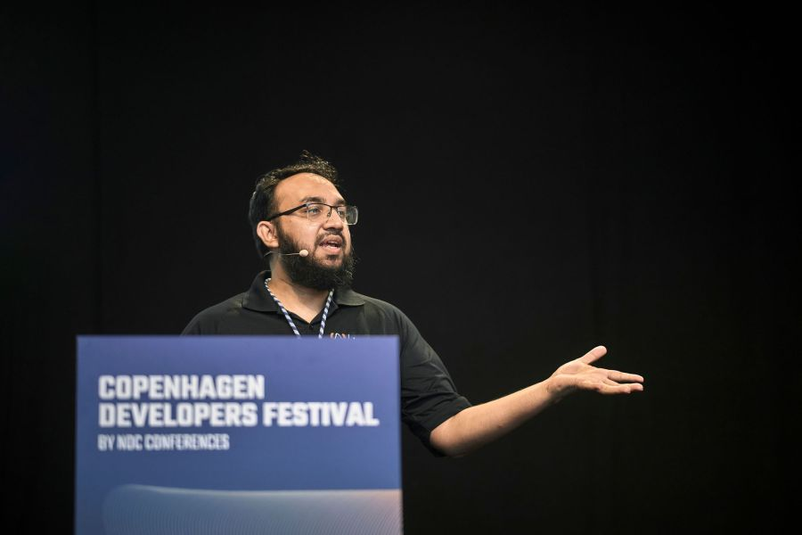
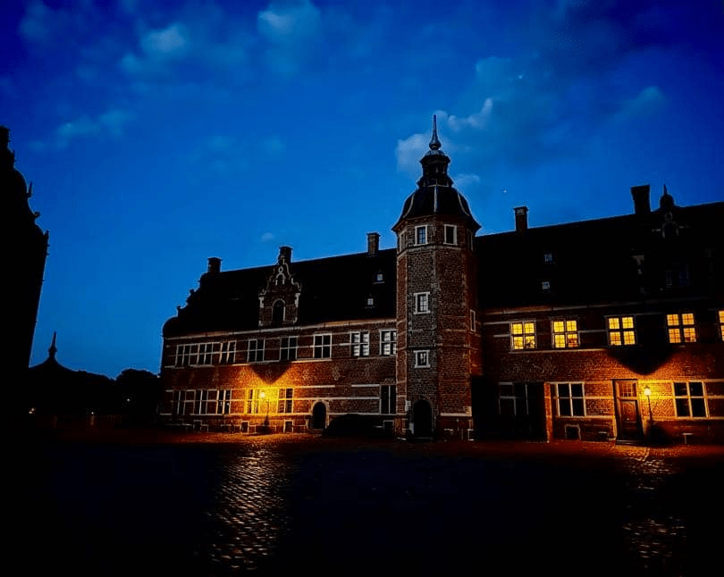

Family, Castles, and Code: Exploring Europe's Old Cities
========================================================

Last month, my family and I finally embarked on a long-awaited trip to the UK, specifically to London. We spent four days there, staying with my uncle and visiting my sister, whom I hadn't seen in five years. Meeting my niece for the first time was a special moment, especially since she wasn't shy at all---she jumped right into my lap, creating an immediate bond. Seeing our daughters, just a few years apart in age, meet for the first time and play together made the family bonding aspect of the trip truly unforgettable.  

Culturally, London felt somewhat familiar, sharing some similarities with Toronto but with a much larger population---it felt three to four times more crowded. Navigating the city was relatively easy, thanks to the efficient tube network, though it was pretty packed. We visited iconic landmarks like Big Ben, the Thames River, the parliament building and Buckingham Palace. One of the highlights was our visit to Greenwich, where we saw the Prime Meridian line, the museum, and Queen Elizabeth I 's palace, and we admired the beautiful scenery.

After London, we travelled to Copenhagen for the Copenhagen Developer Festivals, where I was invited to speak about Java. The conference itself was engaging, with many interesting talks, though I wasn't able to participate in all of them. However, the people, food, and overall atmosphere made the event enjoyable.

After the conference, we took the opportunity to explore the city. Copenhagen felt completely different from what I'm used to---the architecture, the neighbourhood, everything had its charm.

The city's walkability stood out to us, as my wife and I spent an afternoon walking for about three hours with our daughter in the stroller. We also noticed how bicycle-friendly the city is, and it became clear why Copenhagen is considered one of the world's bicycle capitals.

During our time in Copenhagen, we visited Tivoli Gardens and took a boat ride in Nyhavn, where a guide shared some fascinating stories about the city's history. We also met up with a friend of mine, Shaaf, and his wife. They took us to Frederiksborg Castle, where we learned more about Danish history. My daughter, who usually doesn't open up to people outside of the family, formed a lovely bond with Shaaf's wife, which was a sweet highlight of the trip.

  
The next day, we decided to take a swift train ride to Helsingborg, Sweden. The journey was beautiful, passing through the undersea tunnel that connects Denmark and Sweden. We visited Kärnan Castle in Helsingborg and met up with another old friend of my wife and their spouse. We explored the castle, visited a nearby beach, and enjoyed some quality time together. After this lovely day in Sweden, we returned to Copenhagen and, the next day, flew back home to Toronto.

Overall, this trip was a mix of personal and professional highlights, from reuniting with family and friends to exploring new cities and sharing my passion for Java at an international conference. It was an experience I will cherish for a long time.

  

*** ** * ** ***

Type your email... {#subscribe-email}
