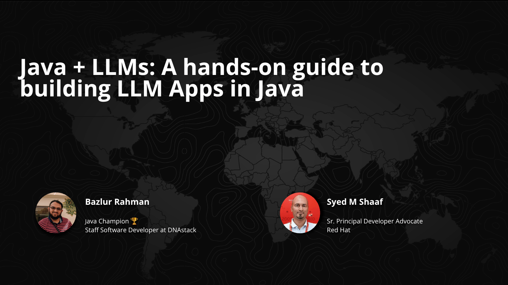

Java + LLMs  + LangChain4j --- 2025 Talk Series
===============================================

[Shaaf](https://www.linkedin.com/in/shaaf/) and I have been heads‑down exploring how **LangChain4j** slots into everyday Java and Jakarta EE projects. Our experiments have grown into a full talk series.

You can find a list of delivered and upcoming talks on my conference page: [https://bazlur.ca/conferences/](/conferences/)

Why we're doing this {#why-we-re-doing-this}
--------------------------------------------

* **LangChain4j** gives Java devs RAG pipelines, vector‑store abstractions, and agent helpers without leaving the JVM.
* **Jakarta EE** supplies the familiar plumbing---CDI, JPA, JAX‑RS---so LLM features drop into existing codebases instead of sitting in sidecars.
* Together they let us prototype AI‑powered features (chat, summarization, semantic search), Function calling, MCP and many more. You can take them straight to production.

What the session covers {#what-the-session-covers}
--------------------------------------------------

* Quick introduction to LLM plumbing in Java
* Prompt design patterns
* Memory management techniques
* Tool integration (function calling)
* **RAG** (Retrieval‑Augmented Generation) end‑to‑end
* vector stores
* Model Context Protocol

Slides: <https://speakerdeck.com/bazlur_rahman/java-plus-llms-a-hands-on-guide-to-building-llm-apps-in-java-with-jakarta-334970cb-c9e9-46ff-931b-65b0a7a50adb>

Try the code {#try-the-code}
----------------------------

We built a progressive demo repo --- <https://github.com/learnj-ai/llm-jakarta> .

We're excited to keep refining these ideas and would love your feedback---see you at the next stop on the schedule!  

*** ** * ** ***

Type your email... {#subscribe-email}
