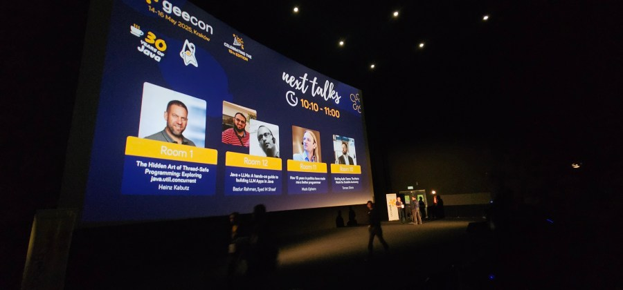
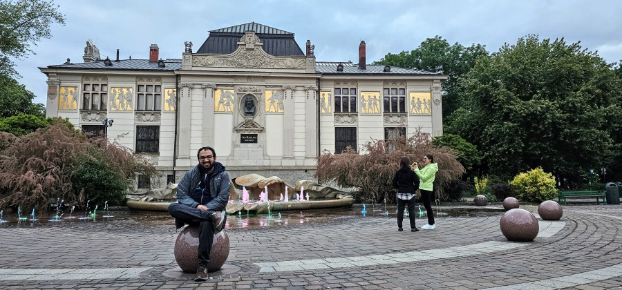
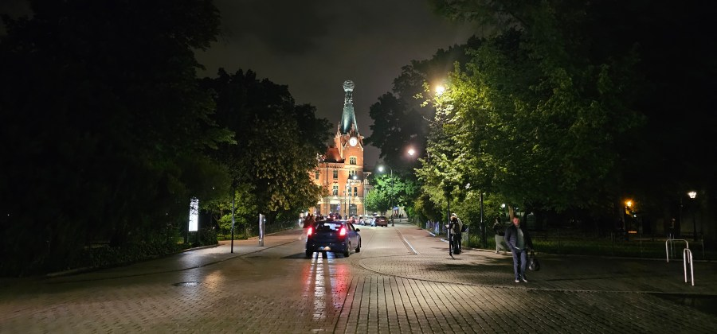

Speaking at GeeCON 2025: A Memorable Kraków Experience
======================================================

I had the pleasure of attending [GeeCON 2025](https://2025.geecon.org/) in Kraków---my very first time at the conference. While the sessions were excellent, what truly stood out was the strong sense of community that made the experience special.

I was also lucky to have some great conversations beyond the tech. I had a wonderful discussion with [Shaaf](https://www.linkedin.com/in/shaaf/), ranging from history to politics, over dinner at a Turkish restaurant and then again at a Pakistani one the next day. Later, I spent time walking around the city with [Mohamed Taman](https://www.linkedin.com/in/mohamedtaman/) --- we took photos in various poses and had fun soaking in Kraków's atmosphere. That evening, we joined the speaker dinner, where we ended up discussing politics, World War history, technology, religion, and just about everything else. We returned to the hotel close to midnight --- a long, engaging, and memorable evening.

Another fun moment: I had a nice chat with [Heinz Kabutz](https://www.linkedin.com/in/heinzkabutz/) at the hotel lobby. Both of us wanted to attend each other's sessions, but unfortunately, they were scheduled at the same time. We laughed about it when Heinz jokingly predicted, *"Your session will have 50 people, and mine will have 5!"* --- a classic, light-hearted moment of speaker camaraderie.

This year, I was fortunate to have two sessions accepted at GeeCON.

The first was "[**Java + LLMs: A Hands-on Guide to Building LLM Apps in Java with Jakarta.**](https://speakerdeck.com/sshaaf/java-plus-llms-a-hands-on-guide-with-bazlur-rahman-and-syed-m-shaaf)"

My co-speaker [Shaaf](https://www.linkedin.com/in/shaaf/) and I presented in a movie theatre with a massive screen, which added an extra thrill to the experience. We demonstrated how Java developers can connect to LLMs using LangChain4j and shared a variety of practical techniques for building intelligent apps. The session drew a full house and was well-received, which was incredibly encouraging. Around 90-100 people joined the session.

Later in the day, I delivered another talk titled "[Breaking Java Stereotypes: It's Not Your Dad's Language Anymore](https://speakerdeck.com/bazlur_rahman/geecon-breaking-java-stereotypes-its-not-your-dads-language-anymore)."

This one was scheduled at the very end of the day, and I only had 20 minutes. By that point, both the audience and I were understandably fatigued from a long day of deep tech. Still, I gave it my all, and I hope I convinced a few attendees to see Java in a new light.

Outside the conference, Kraków itself left a lasting impression. I'm drawn to cities with rich historical backdrops, where the roads, ancient buildings, and even the pavement seem to hold layers of the past. It's humbling to walk on ground that has witnessed the full spectrum of history, from golden ages to the turmoil of war, as this depth is what makes these places so distinct. This stands in stark contrast to many modern cities, which can feel uniform in their amenities.

Kraków, however, is captivating. Its forts, ancient architecture, and historic cobblestones create a remarkable aura. Although my visit lasted only a few days, as a traveller, I found the experience quite worthwhile. The city's unique charm is something that will stay with me for a long time.

On a lighter note, I encountered a cultural quirk. As someone who drinks a lot of water, but almost never the sparkling kind, I was surprised by how ubiquitous sparkling water is in Poland. The question "Still or sparkling?" would come to you if you ask for water. So when I called room service, I made sure to be clear: "A large bottle of still water, please." To my surprise, what arrived was a bottle that could only be described as small or, at best, a medium bottle. Our definitions of 'large' differed!

I look forward to the possibility of catching up with some of you again at a future GeeCON or somewhere else in the Java community! The sense of community and anticipation for future meetings is what makes these experiences truly special.

  

*** ** * ** ***

Type your email... {#subscribe-email}
