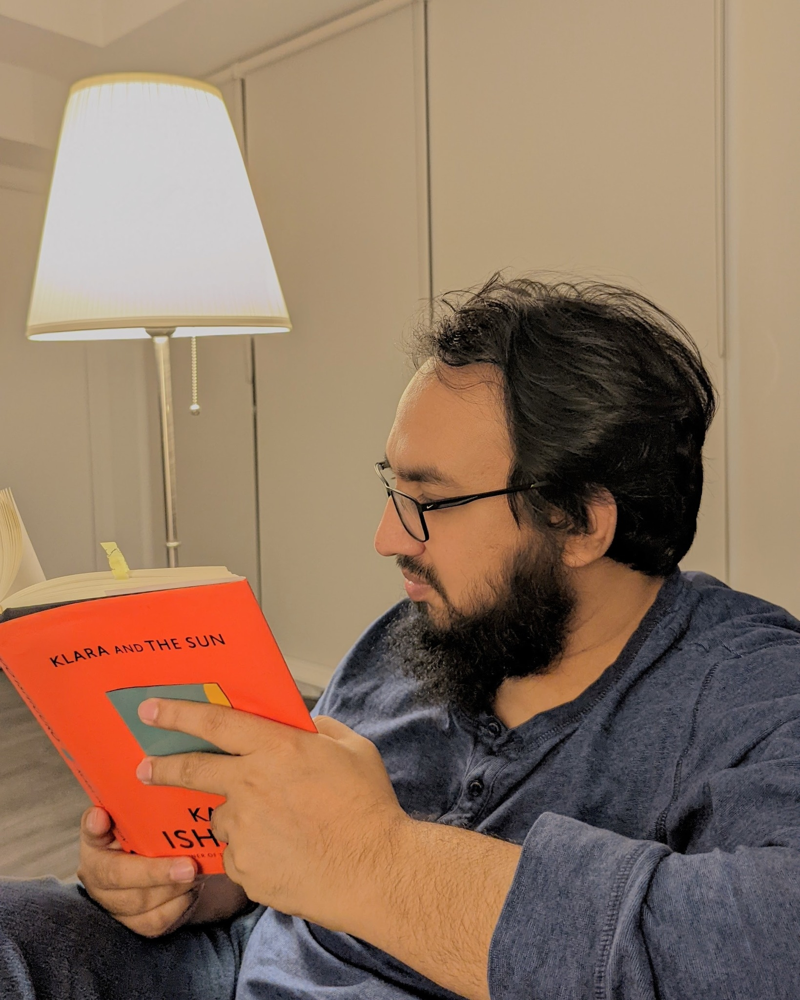

Book Review: Klara and the Sun
==============================

> I recently finished reading "Klara and the Sun" by Kazuo Ishiguro, a work of fiction. I haven't read fiction in a very long time. I used to read a lot, but these days I primarily read technical books. I must admit that reading it made me happy. I should occasionally spend time reading literature, especially non-fiction. It can transport you to a different time and place away from your current affairs, and perhaps it provides the break from reality we all need, given the challenging time we're in.
>
> The book is written from the viewpoint of Klara, an artificial being known as AF---an Artificial Friend. She is quite good at observing things. She pays attention to her environment, engages in conversation with those nearby, comes to her own conclusion, and expresses her ideas.
>
> It portrays a time in the future where lifting is being used to genetically modify children's genomes. The youngster who has been elevated does not attend traditional schools; instead, they are taught online, just like we were during the covid pandemic. The majority of institutions only accept lifted-child, and they are expected to have a great future. Josie, the primary character and a lifted child, receives an AF. Rick, a buddy of Josie's who isn't elevated, finds it difficult to enrol in a reputable university while having a sharp mind. However, some of the side effects of genetic editing don't work for everyone. Every now and then, Josie gets sick, and her parents struggle to care for their sick kid. Josie had an older sister who passed away for the same reason.
>
> Although the story takes place in the future, there are subtly similar family conflicts and mental patterns we experience now. I won't reveal the narrative because I think it is a terrific read overall, and I had a lovely time reading it.
>
*As a side note, I read this book a good while ago, so I thought I'd save the review.*  

*** ** * ** ***

### Discover more from A N M Bazlur Rahman

Subscribe to get the latest posts sent to your email.  
Type your email... {#subscribe-email}

Subscribe {#subscribe-submit}
