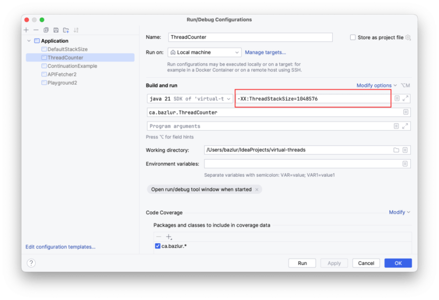

Exploring the Impact of Stack Size on JVM Thread Creation: A Myth Debunked
==========================================================================

**Among Java developers, a prevailing assumption is that the number of native threads that can be created within the Java Virtual Machine (JVM) is linked to the stack size. To scrutinize this widespread notion, an experiment was conducted. The results revealed that stack size plays a less significant role in native thread creation than previously thought.**

**The Experiment**
------------------

The experiment utilized the following Java program, which continuously creates threads and counts them using an [AtomicInteger](https://download.java.net/java/early_access/jdk21/docs/api/java.base/java/util/concurrent/atomic/AtomicInteger.html).

```
import java.util.concurrent.atomic.AtomicInteger;
import java.util.concurrent.locks.LockSupport;

public class ThreadCounter {
   public static void main(String[] args) {
       AtomicInteger counter = new AtomicInteger();

       while (true) {
           Thread thread = new Thread(() -> {
               counter.incrementAndGet();
               if (counter.get() % 100 == 0) {
                   System.out.printf("Number of threads created so far: %d%n", counter.get());
               }
               LockSupport.park();
           });
           thread.start();
       }
   }
}
```

**Test Environment**
--------------------

The test ran on a machine with the following configuration:

* Processor: Apple M1 Max
* Memory: 64 GB
* Operating System: macOS Vancura
* Java Version: openjdk 21

**s**
-----

### **Default Stack Size**

The initial test was conducted using the default stack size of 2048 KB. Approximately 16,300 threads were created before an [OutOfMemoryError](https://download.java.net/java/early_access/jdk21/docs/api/java.base/java/lang/OutOfMemoryError.html) was triggered.

Number of threads created so far: 16300

```
Number of threads created so far: 16300
[3.566s][warning][os,thread] Failed to start thread "Unknown thread" - pthread_create failed (EAGAIN) for attributes: stacksize: 2048k, guardsize: 16k, detached.
[3.566s][warning][os,thread] Failed to start the native thread for java.lang.Thread "Thread-16354"
Exception in thread "main" java.lang.OutOfMemoryError: unable to create native thread: possibly out of memory or process/resource limits reached
```

Calculations indicate that the memory required for these 16,300 threads was around 31.875 GB, well below the total memory of 64 GB.

### **10 MB Stack Size**

To change the stack size to 10 MB, the following JVM option was used:

    -XX:ThreadStackSize=10240

The program yielded a similar result---16,300 threads---before the OutOfMemoryError occurred again.

Number of threads created so far: 16300

```
Number of threads created so far: 16300
[3.995s][warning][os,thread] Failed to start thread "Unknown thread" - pthread_create failed (EAGAIN) for attributes: stacksize: 10240k, guardsize: 16k, detached.
[3.995s][warning][os,thread] Failed to start the native thread for java.lang.Thread "Thread-16354"
Exception in thread "main" java.lang.OutOfMemoryError: unable to create native thread: possibly out of memory or process/resource limits reached
	at java.base/java.lang.Thread.start0(Native Method)
```

In case you want to use IntelliJ IDEA, you can configure the stack size, check the following image:


### **1 GB Stack Size**

Finally, for the most extreme case, the stack size was set to 1 GB using:

    -XX:ThreadStackSize=1048576

Remarkably, the program again maxed out at approximately 16,300 threads, reinforcing the pattern observed in the previous tests.

Number of threads created so far: 16300

```
Number of threads created so far: 16200
Number of threads created so far: 16300
[3.497s][warning][os,thread] Failed to start thread "Unknown thread" - pthread_create failed (EAGAIN) for attributes: stacksize: 1048576k, guardsize: 16k, detached.
[3.497s][warning][os,thread] Failed to start the native thread for java.lang.Thread "Thread-16354"
Exception in thread "main" java.lang.OutOfMemoryError: unable to create native thread: possibly out of memory or process/resource limits reached
```

**Insights from the Data**
--------------------------

The consistency across all three tests underscores that stack size does not affect the number of native threads that can be created. Rather, the limitation appears to be imposed by the operating system.

It's worth noting that the OS was capable of creating more threads than the available physical memory, thanks to the concept of virtual memory. Virtual memory leverages disk space to extend RAM, allowing applications to allocate more memory than is physically present, albeit at a lower access speed.

**Conclusion**
--------------

Contrary to the commonly held belief, this experiment proves that stack size does not have a impact on the number of native threads that can be created in a JVM environment.

The constraint is primarily set by the operating system. This investigation effectively dispels the myth that stack size is the determining factor in native thread limitations.

*** ** * ** ***

***Thank you for reading this. If you have a different perspective on this topic or if your experiments yield different results, I would be very interested to hear about it. Please feel free to share your findings with me.***  

*** ** * ** ***

### Discover more from A N M Bazlur Rahman

Subscribe to get the latest posts sent to your email.  
Type your email... {#subscribe-email}

Subscribe {#subscribe-submit}
