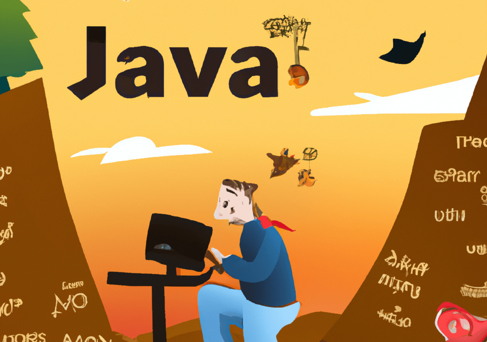

The Java Landscape: A Month with Vaadin, OpenJDK Insights, and Java Enhancements
================================================================================

Dear Readers,{#ember48}

August has arrived a bit early for me, and I find myself reflecting on a month that slipped away in a flurry of activity. This unexpected pace resulted in my missing the chance to write last month's newsletter. However, I'm making amends by writing this month's edition early.{#ember49}

Last week, a spark of inspiration led me to embark on a quick pet project. I wanted to create something simple and elegant, but the thought of diving into the complex world of ReactJs, Vue.js, and other frontend technologies was daunting. I didn't want to spend precious time learning new tools when my heart lies with Java.{#ember51}

That's when I stumbled upon [Vaadin](https://vaadin.com/). Vaadin allowed me to code with Java and only Java, taking me back to the days when I used to love working with Swing. Vaadin is a perfect blend with Spring Boot, and I was able to craft a decent UI without touching a single line of JavaScript.{#ember53}

I must admit, I was quite pleased with the result. But would I recommend Vaadin to others? That's a question I find difficult to answer.{#ember54}

It's an amazing piece of technology allowing you to build something quickly without learning a new front-end language. However, it's worth noting that Vaadin isn't entirely free, and some components might come with a price tag.{#ember55}

Now, let's turn our attention to the content I've contributed over the past month. I've been busy exploring various topics related to Java, and I'm excited to share these pieces with you:{#ember57}

**Original Content:**{#ember59}

* [The Evolution of Java: Challenging Stereotypes and Embracing Modernity](https://foojay.io/today/the-evolution-of-java-challenging-stereotypes-and-embracing-modernity/)
* [Dive into the OpenJDK: Top 10 Reads on Foojay.io](https://foojay.io/today/dive-into-the-openjdk-top-10-reads-on-foojay.io/)
* [Preparing for JDK 21: A Comprehensive Overview of Key Features and Enhancements](https://foojay.io/today/preparing-for-jdk-21-a-comprehensive-overview-of-key-features-and-enhancements/)
* [JEP 451: Balancing Serviceability](https://www.infoq.com/news/2023/07/jep-451-balancing-serviceability/?itm_source=infoq&itm_campaign=user_page&itm_medium=link)
* [JetBrains Unveils AI Assistant](https://www.infoq.com/news/2023/07/jetbrains-unveils-ai-assistant/?itm_source=infoq&itm_campaign=user_page&itm_medium=link)
* [Micronaut Brings Virtual Thread](https://www.infoq.com/news/2023/07/micronaut-brings-virtual-thread/?itm_source=infoq&itm_campaign=user_page&itm_medium=link)
* [Vaadin Release 24](https://www.infoq.com/news/2023/07/vaadin-release-24/?itm_source=infoq&itm_campaign=user_page&itm_medium=link)
* [Modern Cryptography on OpenJDK](https://www.infoq.com/news/2023/07/modern-cryptography-on-openjdk/?itm_source=infoq&itm_campaign=user_page&itm_medium=link)
* [Enhanced Testcontainers Support](https://www.infoq.com/news/2023/07/enhanced-testcontainers-support/?itm_source=infoq&itm_campaign=user_page&itm_medium=link)
* [Java Enhance ZGC](https://www.infoq.com/news/2023/07/java-enhance-zgc/?itm_source=infoq&itm_campaign=user_page&itm_medium=link)
* [Transforming Java Pattern](https://www.infoq.com/news/2023/07/tranforming-java-pattern/?itm_source=infoq&itm_campaign=user_page&itm_medium=link)

**Book Review:**{#ember61}

* [OpenJDK Migration for Dummies](https://foojay.io/today/book-review-openjdk-migration-for-dummies/)

**Interviews:**{#ember63}

* [Exploring the Depths of Java: A Comprehensive Conversation with Jakob Jenkov (Part I)](https://foojay.io/today/exploring-the-depths-of-java-a-comprehensive-conversation-with-jakob-jenkov-part-i/)
* [Exploring the Depths of Java: A Comprehensive Conversation with Jakob Jenkov (Part II)](https://foojay.io/today/exploring-the-depths-of-java-a-comprehensive-conversation-with-jakob-jenkov-part-ii/)
* [Charting the Course of Java: An Insightful Conversation with Java Champion Sebastian Daschner](https://foojay.io/today/charting-the-course-of-java-an-insightful-conversation-with-java-champion-sebastian-daschner/)
* [Busting Myths, Building Futures: A Conversation with Cay Horstmann on Java and Machine Learning](https://foojay.io/today/busting-myths-building-futures-a-conversation-with-cay-horstmann-on-java-and-machine-learning/)

**Inspiring quotes**{#ember66}
> ***Software development is hard, and the reasons for it being hard haven't changed in decades: shifting and hard-to-capture user requirements, poor team dynamics, byzantine architectures, premature optimization, fragile ecosystems, and chasing fads. --***Cay Horstmann
> {#ember67}
> ***The one piece of advice I have is for you to write about something...writing (or communicating in another way, such as a video or podcast), marvelously focuses your attention and makes you into a better writer (or podcaster or video celebrity). --***Cay Horstmann
> {#ember68}
> ***One of the biggest challenges we face is, in my opinion, technical fragmentation. With an ever-increasing list of programming languages, toolkits, frameworks, clouds, and SaaS solutions, it can be really hard to choose "the right tool for the job" --***Jakob Jenkov
> {#ember69}
> ***The biggest challenge for any knowledge worker in these times is distractions. Our phones, email clients, Slack ....The best knowledge workers know how to focus, how to manage distractions, and how to create an environment in which they can fully be "in the zone" --***Sebastian Daschner
> {#ember70}

**Recommended Reads:**{#ember71}

* [Building Event-Based Architecture for Member System](https://tech.deliveryhero.com/building-event-based-architecture-for-member-system/)

This month, my personal reading list has been shorter than usual, but I've started reading an interesting book called "[The Art of Changing Brain](https://www.amazon.ca/Art-Changing-Brain-Enriching-Exploring/dp/1579220541)" by James E. Jull. If I manage to finish this book, you can expect a review soon.{#ember74}

I hope this compilation will keep you engaged for a while. Rest assured, I'll be back next month with more intriguing content. Until then, happy reading!{#ember76}  

*** ** * ** ***

### Discover more from A N M Bazlur Rahman

Subscribe to get the latest posts sent to your email.  
Type your email... {#subscribe-email}

Subscribe {#subscribe-submit}
