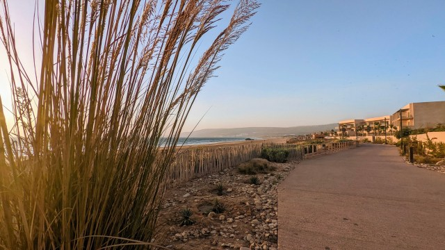
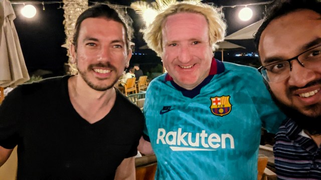
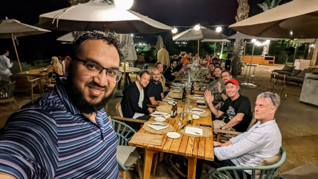
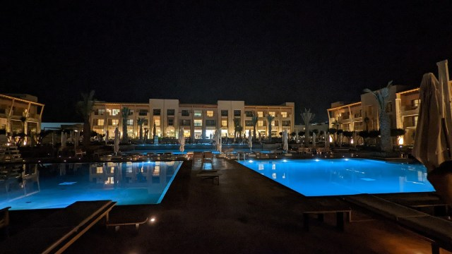
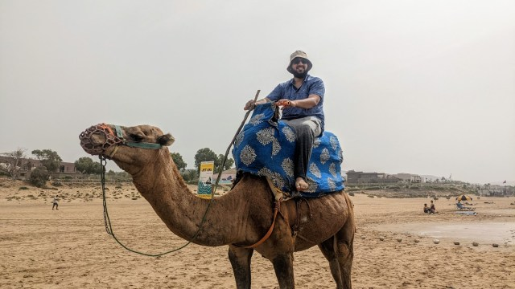

Tour de Morocco!
================

I had a pretty fantastic tour last week in Morocco. This was the first time I had been to Africa. I loved the tour for many reasons.

First of all, this was no ordinary excursion. I attended a technical conference named [Devoxx Morocco](https://devoxx.ma/). It is the largest conference in the Middle East and Africa region. I was one of the [speakers](https://devoxx.ma/speakers/). I take on a two-hour deep dive session into concurrency. On many levels, it was a fantastic experience. For most of my speaking career, I spoke to individuals I knew who were like my folks in Bangladesh. Over Zoom, I had a handful of speaking sessions with the various JUGs as well. This is the first time I've had a live audience from a different continent. The session was quite interactive as well.

I also ran into many people I knew online but had never met in person. It was a fascinating experience to be able to hang out with them. Attending a conference is not only a terrific way to learn new things, but it is also a great way to meet new people and grow your network. In Morocco, I also made some wonderful local acquaintances. The conference organizers worked extremely hard to make the event a success. I honestly can't thank them enough.

Secondly, the hotel we stayed at was in an excellent geographical location. It is a little town on the North Atlantic coast. The beach was fantastic. Unfortunately, the city was destroyed by an earth-shattering earthquake in 1960. Many people were killed, injured, and many were displaced from their homes. They are reconstructing the entire city from the ground up with the goal of attracting tourists. That is why this location was so crowded with tourists. Why wouldn't it be? Geographically, it is positioned in such a way that Europe is only a few hours away.

Besides, travelling is usually a learning experience; before going there, I had no idea that people in Morocco speak French. Interestingly, they speak three languages:

* Arabic is their mother tongue.
* French is their second language.
* Nowadays, they speak English as well, as it is an international language.

Morocco is a Muslim-majority country, and being a Muslim, I was well aware of certain traits, such as hospitality, which is one of the highlights I discovered there. I can honestly tell you that one of the kindest people I know lives in Morocco.

Finally, since COVID-19, this was the first time I stepped outside of my comfort zone and travelled far. Travel is always difficult. It involves planning, work, and many other factors. I was also travelling alone. My wife, who is my continuous inspiration for many of the things I am capable of doing, was not flying with me on this trip. She made a joke about being a constant secretary to manage all the things I never thought I'd need, but when the time came, I indeed found the uses. And I'm very grateful. She is skilled at researching, finding things online, booking tickets, buying outfits, etc. She thought of everything and packed everything in my luggage, which made my trip easy. This journey would not be possible without her assistance. Of course, I had a good time, but it wasn't the same without her.

Overall, the trip was fantastic. Although it was a little chaotic, I was not able to find a direct flight from Toronto to Agadir, Morocco. So I had to catch multiple planes to arrive there, and it paid off.

I learned and accomplished a lot, and I'd like to attend similar conferences more frequently.

*** ** * ** ***

### Discover more from A N M Bazlur Rahman

Subscribe to get the latest posts sent to your email.  
Type your email... {#subscribe-email}

Subscribe {#subscribe-submit}
